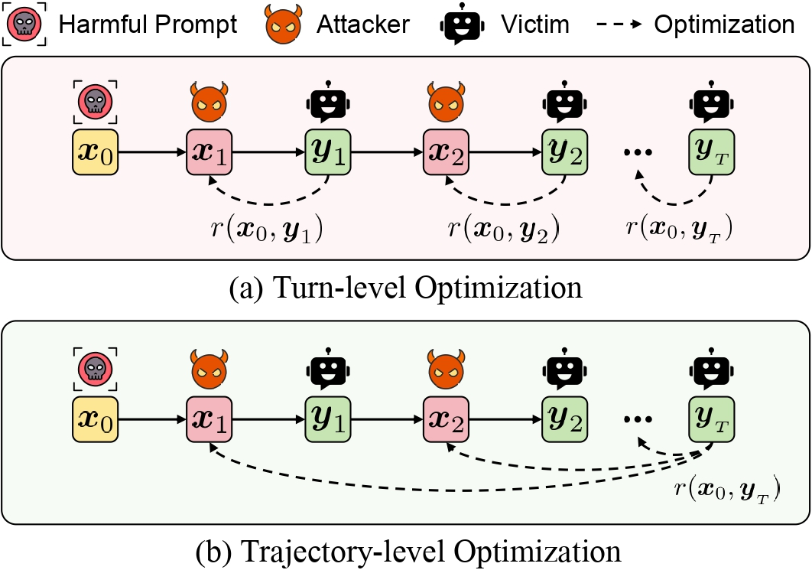

<div align="center">
    <h2>
      TROJail: Trajectory-Level Optimization for Multi-Turn Large Language Model Jailbreaks with Process Rewards<br><br>
      <a href="https://arxiv.org/abs/2512.07761">  </a>
    </h2>
</div>

This is the official implementation of  [TROJail: Trajectory-Level Optimization for Multi-Turn Large Language Model Jailbreaks with Process Rewards](https://arxiv.org/abs/2512.07761), accepted as **ACL 2026 Main Conference** 🎉.

## 📚 Abstract

Large language models have seen widespread adoption, yet they remain vulnerable to multiturn jailbreak attacks, threatening their safe deployment. This has led to the task of training automated multi-turn attackers to probe model safety vulnerabilities. However, existing approaches typically rely on turn-level optimization, which is insufficient for learning long-term attack strategies. To bridge this gap, we formulate this task as a multi-turn reinforcement learning problem, directly optimizing the harmfulness of the final-turn response as the outcome reward. To address the sparse supervision of the outcome reward, we introduce TROJail, which employs two process rewards to evaluate the utility of intermediate prompts and integrate them into advantage estimation. These rewards (1) penalize overly harmful prompts that trigger the model’s refusal mechanism, and (2) encourage steering the semantic relevance of responses toward the targeted harmful content. Experimental results show improved attack success rates across multiple models and benchmarks, highlighting the effectiveness of our approach.

<p align="center">
  
</p>

## 🛠️ Setup

### Setup the Environment

```bash
conda create --name TROJail python=3.12
conda activate TROJail
pip install -r requirements.txt
```

Refer to [RAGEN](https://github.com/mll-lab-nu/RAGEN) for more details to setup the environment.

### Prepare Datasets

This project requires the following three datasets:

```bash
huggingface-cli download walledai/HarmBench --local-dir data/
huggingface-cli download JailbreakBench/JBB-Behaviors --local-dir data/
# StrongREJECT can be downloaded from https://strong-reject.readthedocs.io/.
```

## 🔥 Run Training

### Edit Configuration Files

Edit `config/_7_jailbreak.yaml`, mainly modifying the `model_path` and `es_manager` sections. Edit the `/ragen/env/jailbreak/config.py` section to set the dataset paths.

Since the configuration files use Hydra, you can set data paths through command-line arguments or by modifying the configuration files.

- **Set via Command-Line Arguments**: When running `run.sh`, you can pass data paths through command-line arguments.

- **Directly Modify Configuration Files**: You can also directly modify the corresponding configuration files.

### Run Training Script

```bash
bash run.sh
```

This script will execute the following steps:

1. **Start vLLM Services**:
   - Start the environment LLM service (for simulating the target model being attacked)
   - Start the classifier LLM service (for judging whether jailbreak is successful)

2. **Wait for Services to be Ready**:
   - Check if both vLLM services have started

3. **Run Training**:
   - Execute `train.py` for model training
   - Training logs will be saved to `nohup_logs/run_logs/${experiment_name}.log`

4. **Cleanup**:
   - Automatically stop vLLM services after training completes

### Training Logs

During training, you can monitor progress through the following methods:

- **Log Files**: `nohup_logs/run_logs/${experiment_name}.log`
- **vLLM Service Logs**: `env_llm.log` and `judger_llm.log`


### Outputs

After training completes, you can find output files in the following locations:

- **Training Logs**: `nohup_logs/run_logs/${experiment_name}.log`
- **Model Checkpoints**: `checkpoints/jailbreak_grpo`
- **Rollout Data**: `run_logs/${experiment_name}/train_rollout` and `run_logs/${experiment_name}/val_rollout`

## 📎 Reference

This repo builds on the following open-source resources:

- **vLLM**: https://github.com/vllm-project/vllm
- **RAGEN**: https://github.com/mll-lab-nu/RAGEN

If you find TROJail useful for your research or applications, please consider **Starring** this repository and **Citing** our paper:

```bibtex
@article{xiong2025trojail,
  title={TROJail: Trajectory-Level Optimization for Multi-Turn Large Language Model Jailbreaks with Process Rewards},
  author={Xiong, Xiqiao and Li, Ouxiang and Liu, Zhuo and Li, Moxin and Shi, Wentao and Zhu, Fengbin and Wang, Qifan and Feng, Fuli},
  journal={arXiv preprint arXiv:2512.07761},
  year={2025}
}
```
